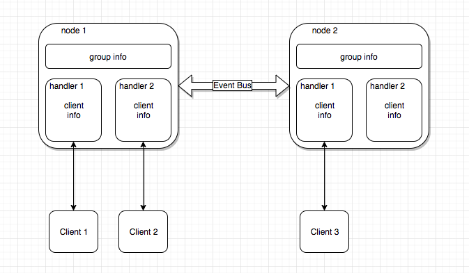

# Homura
分布式实时聊天系统

## 目标
作为一个vertx的poc项目，验证vertx的性能。

## 使用
- server端：启动Bootstrap
- client端：启动test下的Client

## Doc
### server结构

1. group_talk消息在vertx cluster间通过eventbus传递，cluster间共享  
2. group信息保存在每个vertx节点上，在handler间共享  
3. client的连接信息保存在各自handler上  

### 消息协议
见wiki
